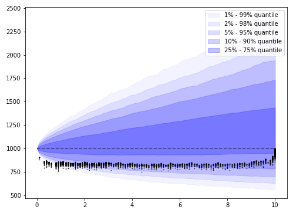

# American Monte Carlo

Implementation of the Longstaff-Schwartz (American Monte Carlo) algorithm for pricing options and other derivatives with early-exercise features.

Please refer to the [Jupyter notebook](main.ipynb) for the overview of main features.

Few screenshots from the jupyter notebook:

## Forward path generation

Initial forward path generation

## Put option payoff

Expiration payoff of the put option with early-exercise features, which will be priced using American Monte Carlo.

## Payoff regressions

Regression of payoff from time t+1 (discounted to time t), against observable value at t:

## Payoffs

Distribution of underlying (at different quantiles) and list of all option payoffs marked by black dots. Final option value with early-exercise features is then calculated as expectation of discounted payoffs.

